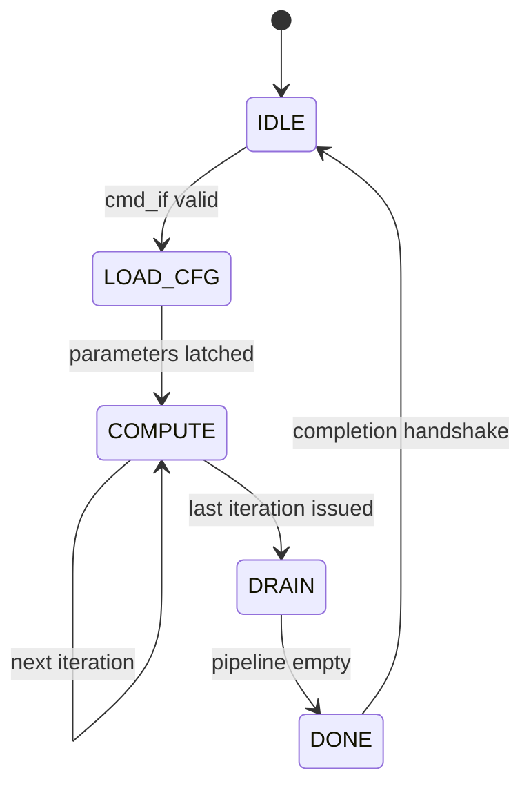

# Convolution Dataflow

This document describes the execution model and data movement for a single
2D convolution operation inside the lg-npu compute backend
(`rtl/backends/conv/`).

All data types are INT8 unless stated otherwise. See
[overview.md](overview.md) for the full system context.

---

## Convolution Parameters

A `CONV` command descriptor carries the following parameters:

| Symbol | Meaning |
|--------|---------|
| N | Batch size (always 1 in current scope) |
| H, W | Input activation spatial height and width |
| C | Number of input channels |
| K | Number of output channels (filters) |
| R, S | Filter height and width |
| stride_h, stride_w | Vertical and horizontal stride |
| pad_h, pad_w | Zero-padding applied to the input |
| OH, OW | Output spatial height and width (derived: `OH = (H + 2·pad_h − R) / stride_h + 1`) |

All tensors live in local SRAM in NHWC layout (channel-last). This means a
single element at position (n, h, w, c) sits at byte offset
`((n·H + h)·W + w)·C + c` relative to the tensor base address.

---

## Data Layout in SRAM

| Buffer | Contents | Element type | Logical shape |
|--------|----------|-------------|---------------|
| Weight buffer | Filter kernels | INT8 | K x R x S x C (stored as NHWC with N = K) |
| Activation buffer (input) | Input feature map | INT8 | 1 x H x W x C |
| Activation buffer (output) | Output feature map | INT8 | 1 x OH x OW x K |
| Partial-sum buffer | Accumulator state | INT32 | 1 x OH x OW x K |

Input and output activations share the same physical activation buffer at
different base-address offsets. The command descriptor specifies both offsets
so they do not overlap.

---

## Loop Nest

`conv_ctrl` implements the convolution as a set of nested loops. The
canonical loop order is:

```
for oh in 0 .. OH-1:          // output row
  for ow in 0 .. OW-1:        // output column
    for k in 0 .. K-1:        // output channel
      acc[oh][ow][k] = 0      // INT32
      for r in 0 .. R-1:      // filter row
        for s in 0 .. S-1:    // filter column
          for c in 0 .. C-1:  // input channel
            ih = oh * stride_h + r - pad_h
            iw = ow * stride_w + s - pad_w
            if (ih, iw) in bounds:
              act = activation[ih][iw][c]   // INT8
              wt  = weight[k][r][s][c]      // INT8
              acc[oh][ow][k] += act * wt    // INT8xINT8 -> INT32
      // post-processing
      acc[oh][ow][k] += bias[k]            // INT32 += sign_ext(INT8)
      acc[oh][ow][k]  = max(0, acc[oh][ow][k])  // ReLU
      out[oh][ow][k]  = quantize(acc[oh][ow][k]) // INT32 -> INT8
```

The inner three loops (r, s, c) accumulate into a single INT32 partial sum.
Once all input channels are accumulated for a given output pixel and filter,
the post-processing chain runs in place.

---

## Hardware Mapping

### conv_ctrl

Finite-state machine that sequences through the loop nest above. It
generates loop indices (oh, ow, k, r, s, c) and control signals for every
pipeline stage.



| State | Action |
|-------|--------|
| IDLE | Wait for a dispatch command on the `cmd_if`. |
| LOAD_CFG | Latch convolution parameters from the command struct. |
| COMPUTE | Drive the loop counters. Advance one inner iteration per cycle (subject to back-pressure from memory or the PE array). |
| DRAIN | Wait for the last result to exit the post-processing pipeline. |
| DONE | Assert completion handshake back to `npu_dispatch`. Return to IDLE. |

### conv_addr_gen

Combinationally computes SRAM read addresses from the current loop indices:

- **Activation address**: `act_base + ((ih * W) + iw) * C + c`
- **Weight address**: `wt_base + ((k * R + r) * S + s) * C + c`

For out-of-bounds (ih, iw) due to padding, `conv_addr_gen` signals
`zero_pad`, and the loader substitutes a zero value instead of issuing a
memory read.

### conv_loader

Issues read requests to the weight buffer and activation buffer through
`mem_req_rsp_if`. It receives address and zero-pad signals from
`conv_addr_gen`, reads one INT8 weight and one INT8 activation per cycle,
and sends the pair downstream on a `stream_if`.

Addresses from `conv_addr_gen` are **latched inside `conv_loader`** at the
cycle the iteration is accepted (the S_IDLE -> S_REQ transition). This is
necessary because `conv_ctrl` advances its loop counters on the same cycle
as `iter_accept`, which means the combinational address outputs change
before the loader issues memory requests in the following state. The
latched copies (`act_addr_r`, `wt_addr_r`) are used for the actual memory
read addresses.

### conv_line_buffer & conv_window_gen (not instantiated)

`conv_line_buffer` and `conv_window_gen` exist in the source tree but are
**not instantiated** by `conv_backend` in the current implementation. The
loader re-fetches every activation value directly from SRAM.

These modules are intended for a future optimisation: `conv_line_buffer`
would cache recent activation rows to reduce read bandwidth when R or S > 1,
and `conv_window_gen` would assemble the receptive-field window from the
line-buffer output.

### conv_array & conv_pe

`conv_array` is a spatial array of `conv_pe` instances. Each PE performs:

```
acc += act_in * wt_in    // INT8 x INT8 -> INT32 accumulate
```

In the minimal configuration the array is a single PE (1 x 1), processing
one multiply-accumulate per cycle. The array width and height are
compile-time parameters in `npu_cfg_pkg`.

Each PE exposes:

| Port | Direction | Width | Description |
|------|-----------|-------|-------------|
| `act_in` | in | 8 | Signed activation sample |
| `wt_in` | in | 8 | Signed weight sample |
| `acc_in` | in | 32 | Partial sum from previous accumulation |
| `acc_out` | out | 32 | Updated partial sum |
| `valid_in` | in | 1 | Upstream handshake |
| `ready_out` | out | 1 | Upstream handshake |
| `valid_out` | out | 1 | Downstream handshake |
| `ready_in` | in | 1 | Downstream handshake |

### conv_accum

Register file or small SRAM that holds the INT32 partial sums for the
output tile currently being computed. When the inner loop (r, s, c) starts
for a new (oh, ow, k), the accumulator is cleared to zero. Each MAC result
from the PE array updates the accumulator entry. Once the inner loop
completes, the accumulated value is forwarded to post-processing.

### conv_postproc

Pipeline stage that chains:

1. **conv_bias** — Adds a sign-extended INT8 bias (`bias[k]`) to the INT32
   accumulator value.
2. **conv_activation** — Applies ReLU: `result = (val < 0) ? 0 : val`.
3. **conv_quantize** — Right arithmetic shift by a programmable amount,
   then signed saturation to [-128, +127], producing the final INT8 output.

Each sub-stage is a single pipeline register on the `stream_if`
valid/ready path.

### conv_writer

Takes the INT8 output from `conv_postproc` and issues a write request to the
activation buffer at the computed output address:

```
out_addr = out_base + ((oh * OW) + ow) * K + k
```

A write response from `mem_req_rsp_if` confirms the store.

---

## Pipeline Diagram (Single-PE, Steady State)

```
Cycle   conv_loader    conv_pe (MAC)    conv_postproc    conv_writer
──────  ────────────   ──────────────   ──────────────   ────────────
  t     read act[t]    acc += a·w [t-1]     —                —
  t+1   read wt[t+1]   acc += a·w [t]   bias+relu+q [t-1]   —
  t+2   read act[t+2]  acc += a·w [t+1] bias+relu+q [t]  write [t-1]
  ...
```

With a single PE, throughput is **one MAC per cycle**. The total cycle count
for a convolution is approximately:

$$\text{cycles} \approx OH \times OW \times K \times R \times S \times C + \text{pipeline overhead}$$

### Two-Stage Pipeline Alignment

`conv_backend` uses a two-stage pipeline to align control signals with data:

- **Stage 1 (iter_accept)** — When `conv_ctrl` issues an iteration and the
  loader accepts it, `conv_backend` captures `last_inner`, `acc_clr`,
  `wr_addr`, and `bias_addr` into first-stage registers.
- **Stage 2 (pe_accept)** — When the PE consumes the data pair, the
  first-stage values advance into second-stage registers that feed the
  accumulator and post-processing chain.

This alignment is necessary because the loader takes multiple cycles
(request + wait) before the PE sees valid data. Without the two-stage pipe,
control signals would arrive at the accumulator before (or after) their
corresponding data.

### Back-Pressure

Every stage uses `stream_if` valid/ready handshaking. If the writer stalls
(e.g. SRAM port busy), back-pressure propagates through the post-processing
chain, the PE, and into the loader. No data is lost.

---

## Address-Generation Example

Given a 4 x 4 input with C = 1, a 3 x 3 filter with K = 1, stride = 1,
pad = 0, the output is 2 x 2. The loader issues reads in this order:

```
oh=0, ow=0: act[0,0] wt[0,0,0]  act[0,1] wt[0,0,1]  act[0,2] wt[0,0,2]
            act[1,0] wt[0,1,0]  act[1,1] wt[0,1,1]  act[1,2] wt[0,1,2]
            act[2,0] wt[0,2,0]  act[2,1] wt[0,2,1]  act[2,2] wt[0,2,2]
            -> postproc -> write out[0,0]

oh=0, ow=1: act[0,1] wt[0,0,0]  ...
            -> postproc -> write out[0,1]

oh=1, ow=0: act[1,0] wt[0,0,0]  ...
            -> postproc -> write out[1,0]

oh=1, ow=1: act[1,1] wt[0,0,0]  ...
            -> postproc -> write out[1,1]
```

---

## Interaction with the Rest of the System

1. `npu_dispatch` programs `conv_backend` by pushing a command on `cmd_if`
   that contains base addresses, dimensions, and quantization shift.
2. `conv_backend` drives `mem_req_rsp_if` to read weights and activations
   from `npu_weight_buffer` / `npu_act_buffer` and to write results back to
   `npu_act_buffer`. These requests are routed by `npu_buffer_router`.
3. When the last output pixel has been written and acknowledged,
   `conv_backend` asserts a `done` signal. `npu_completion` captures this
   and notifies the host via `npu_irq_ctrl`.

No DMA or external memory interaction occurs. The host is responsible for
filling the weight and activation buffers over MMIO before submitting the
command, and for reading the results back afterwards.
