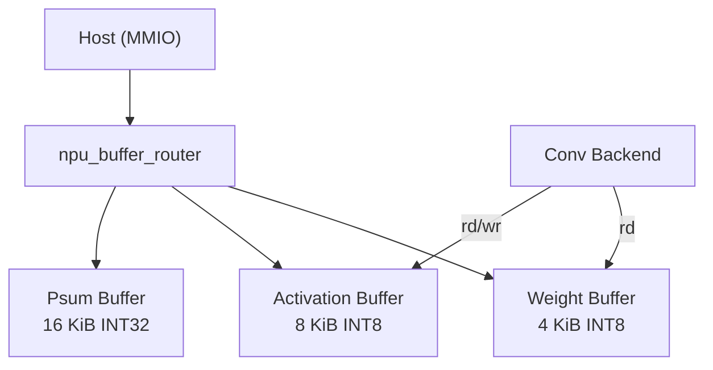
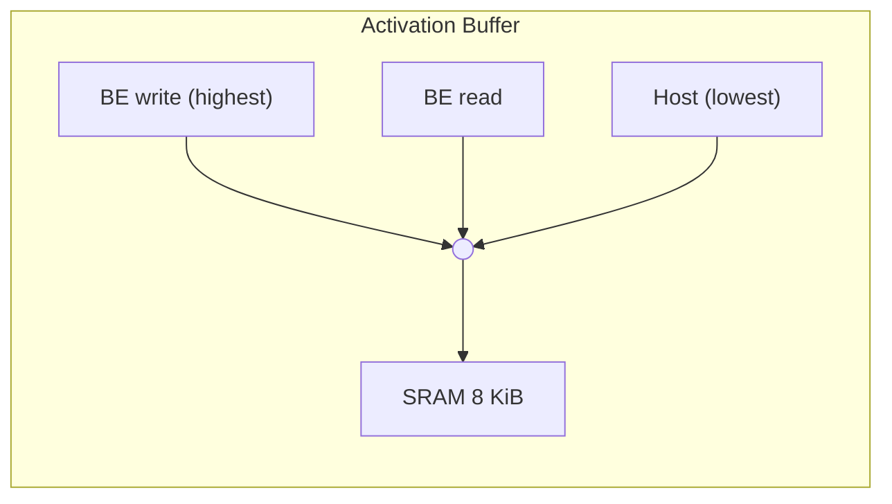

# Memory Hierarchy

Source of truth: `rtl/memory/npu_buffer_router.sv`,
`rtl/memory/npu_local_mem_wrap.sv`, `include/pkg/npu_cfg_pkg.sv`.

---

## Overview

The v0.1 NPU uses **local SRAM only** — there is no DMA engine, no
external DRAM, and no cache hierarchy. The host loads all tensor data
through MMIO buffer windows and reads results back the same way.

---

## SRAM Banks

All buffers are backed by `npu_local_mem_wrap`, which wraps a behavioural
single-port SRAM (`mem_macro_wrap`) behind a `req/gnt/rvalid` protocol.

| Buffer | Module | Depth | Width | Total Size | MMIO Base |
|--------|--------|-------|-------|------------|-----------|
| Weight | `npu_weight_buffer` | 4096 | 8 b | 4 KiB | `0x1_0000` |
| Activation | `npu_act_buffer` | 8192 (2x4096) | 8 b | 8 KiB | `0x2_0000` |
| Psum | `npu_psum_buffer` | 4096 | 32 b | 16 KiB | `0x3_0000` |

- **Weight buffer**: Single-port, holds both filter kernels and bias values.
  Weight and bias reads are time-multiplexed on the single backend read port;
  backend read has priority over host.
- **Activation buffer**: Single-port, double-sized (input + output share
  the address space). Three requesters arbitrated with fixed priority:
  backend write > backend read > host.
- **Psum buffer**: Host-only in v0.1 (the conv backend keeps partial sums
  in internal accumulator registers). Reserved for future tiling support.

---

## Arbitration

Each buffer wrapper performs fixed-priority mux arbitration in front of the
single physical SRAM port. There is no round-robin; the backend always wins
when it has an active request, ensuring no stalls in the compute datapath.

---

## SRAM Timing

`npu_local_mem_wrap` implements a **single-cycle** read latency:

| Cycle | Event |
|-------|-------|
| T | `req` + `addr` asserted; `gnt` raised immediately |
| T+1 | `rdata` valid, `rvalid` asserted (for reads) |

Writes take effect at the positive clock edge of cycle T.

---

## Buffer Router

`npu_buffer_router` sits between `npu_reg_block` (host MMIO) and the three
buffer wrappers. It decodes the host MMIO address to select the target
buffer, passes the transaction through, and muxes the read data back.

Address decode:

| Condition | Selected Buffer |
|-----------|----------------|
| `addr ∈ [0x1_0000, 0x2_0000)` | Weight |
| `addr ∈ [0x2_0000, 0x3_0000)` | Activation |
| `addr ≥ 0x3_0000` | Psum |