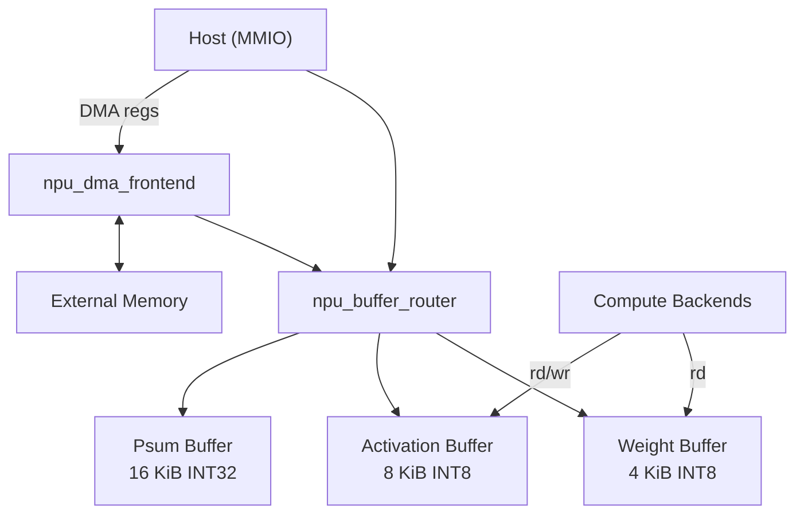
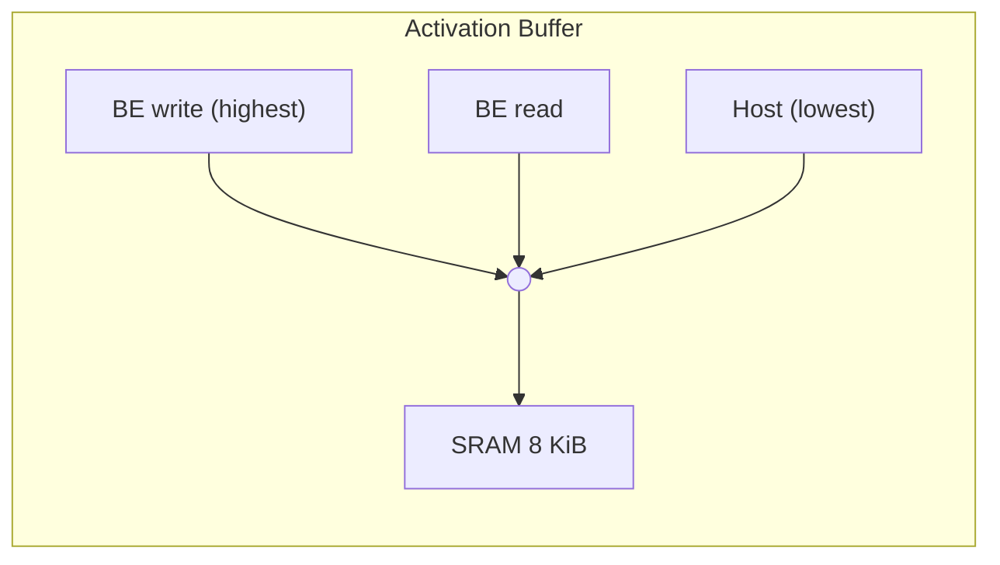
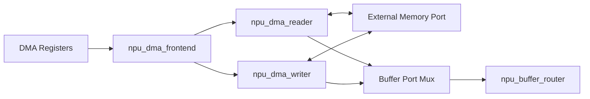

# Memory Hierarchy

Source of truth: `rtl/memory/npu_buffer_router.sv`,
`rtl/memory/npu_local_mem_wrap.sv`, `include/pkg/npu_cfg_pkg.sv`.

---

## Overview

The NPU uses **local SRAM** for all compute data. The host can load tensor
data through MMIO buffer windows or use the **DMA engine** to bulk-transfer
data between external memory and local buffers.

---

## SRAM Banks

All buffers are backed by `npu_local_mem_wrap`, which wraps a behavioural
single-port SRAM (`mem_macro_wrap`) behind a `req/gnt/rvalid` protocol.

| Buffer | Module | Depth | Width | Total Size | MMIO Base |
|--------|--------|-------|-------|------------|-----------|
| Weight | `npu_weight_buffer` | 4096 | 8 b | 4 KiB | `0x1_0000` |
| Activation | `npu_act_buffer` | 8192 (2x4096) | 8 b | 8 KiB | `0x2_0000` |
| Psum | `npu_psum_buffer` | 4096 | 32 b | 16 KiB | `0x3_0000` |

- **Weight buffer**: Single-port, holds both filter kernels and bias values.
  Weight and bias reads are time-multiplexed on the single backend read port;
  backend read has priority over host.
- **Activation buffer**: Single-port, double-sized (input + output share
  the address space). Three requesters arbitrated with fixed priority:
  backend write > backend read > host.
- **Psum buffer**: Host-only in v0.1 (the conv backend keeps partial sums
  in internal accumulator registers). Reserved for future tiling support.

---

## Arbitration

Each buffer wrapper performs fixed-priority mux arbitration in front of the
single physical SRAM port. There is no round-robin; the backend always wins
when it has an active request, ensuring no stalls in the compute datapath.

---

## SRAM Timing

`npu_local_mem_wrap` implements a **single-cycle** read latency:

| Cycle | Event |
|-------|-------|
| T | `req` + `addr` asserted; `gnt` raised immediately |
| T+1 | `rdata` valid, `rvalid` asserted (for reads) |

Writes take effect at the positive clock edge of cycle T.

---

## Buffer Router

`npu_buffer_router` sits between `npu_reg_block` (host MMIO) and the three
buffer wrappers. It decodes the host MMIO address to select the target
buffer, passes the transaction through, and muxes the read data back.

Address decode:

| Condition | Selected Buffer |
|-----------|----------------|
| `addr ∈ [0x1_0000, 0x2_0000)` | Weight |
| `addr ∈ [0x2_0000, 0x3_0000)` | Activation |
| `addr ≥ 0x3_0000` | Psum |

---

## DMA Engine

The DMA engine (`npu_dma_frontend`) enables bulk transfers between an
external memory port and the local SRAM buffers. It is register-driven
(not command-driven) and operates independently of the command pipeline.

### Architecture

### Registers

| Offset | Name | R/W | Description |
|--------|------|-----|-------------|
| `0x0030` | `DMA_EXT_ADDR` | RW | External memory base address (32-bit) |
| `0x0034` | `DMA_LOC_ADDR` | RW | Local buffer base address (20-bit MMIO space) |
| `0x0038` | `DMA_LEN` | RW | Transfer length in bytes |
| `0x003C` | `DMA_CTRL` | WO | bit 0: start (self-clearing pulse), bit 1: direction (0 = read ext->local, 1 = write local->ext) |
| `0x0040` | `DMA_STATUS` | RO | bit 0: busy |

### Transfer Protocol

- **Read** (ext -> local): The reader FSM issues an external memory read
  request, waits for `rvalid`, then writes the received data to the local
  buffer at the configured address. This repeats byte-by-byte for `LEN`
  bytes.
- **Write** (local -> ext): The writer FSM reads from the local buffer,
  waits for `rvalid`, then issues an external memory write. Repeats for
  `LEN` bytes.

### External Memory Port

The shell exposes a simple req/gnt/rvalid memory interface:

| Signal | Dir | Width | Description |
|--------|-----|-------|-------------|
| `ext_mem_addr` | out | 32 | Address |
| `ext_mem_wdata` | out | 32 | Write data |
| `ext_mem_wr` | out | 1 | Write enable (0 = read) |
| `ext_mem_req` | out | 1 | Request valid |
| `ext_mem_gnt` | in | 1 | Grant (request accepted) |
| `ext_mem_rdata` | in | 32 | Read data |
| `ext_mem_rvalid` | in | 1 | Read data valid |

### Concurrency

DMA and compute are mutually exclusive. When DMA is busy:
- The DMA frontend takes over the buffer port (host MMIO path is blocked).
- `npu_status` reports the core as busy.
- DMA done generates an IRQ (OR'd with command completion).