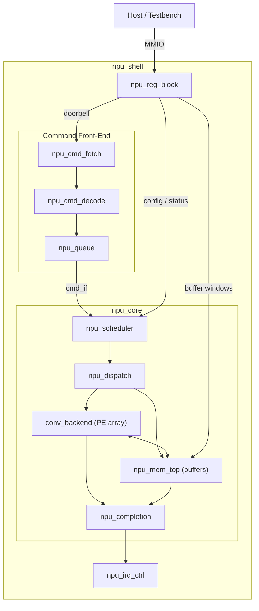

# Architecture Overview

## Scope

The lg-npu targets efficient neural-network inference in hardware. The initial
scope is deliberately narrow to bring up a working end-to-end path as quickly
as possible:

| Aspect | Decision |
|--------|----------|
| Data type | INT8 (signed 8-bit) exclusively. Weights, activations, and biases are all INT8; the MAC array accumulates into INT32, and a post-processing quantize step converts the result back to INT8. |
| Compute | 2D convolution only. No GEMM, pooling, element-wise, or attention operations. |
| Tensor layout | A single canonical layout (NHWC). All tensors in memory use this ordering. |
| Command interface | One opcode (`CONV`). Software submits a descriptor that fully describes a single convolution tile. |
| Memory | Local on-chip SRAM only (weight buffer, activation buffer, partial-sum buffer). No external DRAM path; no DMA transfers. Software pre-loads buffers before issuing the command. |
| Platform | Simulation-only. No FPGA or ASIC bring-up. |

These constraints mean the first passing test is: software writes INT8 weights
and activations into the local buffers over MMIO, posts a single `CONV`
command, waits for completion, and reads the INT8 result back from the
activation buffer.

---

## High-Level Block Diagram

---

## Module Hierarchy

### Shell (`rtl/core/npu_shell.sv`)

Top-level wrapper that is instantiated by any platform (simulation, FPGA,
ASIC). It contains the host-facing MMIO interface and connects the register
block, command front-end, and core. The shell exposes a single `mmio_if` to
the host.

### Register Block (`rtl/control/npu_reg_block.sv`)

Memory-mapped control/status register file. Provides:

- **Control registers** — command queue doorbell, soft reset, interrupt enable.
- **Status registers** — queue state, feature ID, hardware status.
- **Buffer windows** — address ranges that map directly into the weight,
  activation, and partial-sum SRAM banks, allowing the host to read/write
  tensor data over MMIO.

### Command Front-End

| Module | Role |
|--------|------|
| `npu_cmd_fetch` | Reads a command descriptor from the queue entry pointed to by the doorbell write. |
| `npu_cmd_decode` | Validates the opcode and extracts fields into an internal command struct. Exposes a `busy` output so the pipeline knows a decode is in flight. |
| `npu_queue` | Shallow FIFO (depth configurable, default 4) that holds decoded commands until the core is ready. |

Only one opcode is defined: `CONV`. The descriptor carries the tensor base
addresses (offsets into local SRAM), spatial dimensions (H, W, C, K, R, S),
and stride/padding values.

### Core (`rtl/core/npu_core.sv`)

Orchestrates command execution.

| Module | Role |
|--------|------|
| `npu_scheduler` | Picks the next command from the queue. In the current scope this is trivial — in-order, one at a time. |
| `npu_dispatch` | Translates the command into a sequence of control signals for the memory subsystem and compute backend. |
| `npu_completion` | Tracks when the backend signals done, writes a completion entry, and triggers `npu_irq_ctrl`. |
| `npu_status` | Aggregates internal state into the status register read by the host. The idle flag accounts for backend busy, queue occupancy, **and** `cmd_pipe_busy` (fetch or decode in progress), preventing the host from seeing a false idle while a command is still being ingested. |

### Memory Subsystem (`rtl/memory/`)

All storage is on-chip SRAM accessed through simple request/grant handshakes
with explicit signal-level ports.

| Module | Role |
|--------|------|
| `npu_mem_top` | Top-level memory interconnect. |
| `npu_weight_buffer` | SRAM bank holding INT8 weights. Read by the conv loader. |
| `npu_act_buffer` | SRAM bank holding INT8 input activations and output activations. |
| `npu_psum_buffer` | SRAM bank holding INT32 partial sums during accumulation. |
| `npu_local_mem_wrap` | Technology wrapper around the physical SRAM macro (maps to simulation model, FPGA BRAM, or ASIC SRAM). |
| `npu_buffer_router` | Routes read/write requests between the host MMIO path, the conv datapath, and the buffer banks. |

DMA modules (`npu_dma_reader`, `npu_dma_writer`, `npu_dma_frontend`) exist in
the source tree but are **not used** in the current scope. Data enters and
leaves the buffers exclusively over the host MMIO path.

### Convolution Backend (`rtl/backends/conv/`)

The compute engine. Described in detail in [conv_dataflow.md](conv_dataflow.md).

| Module | Role |
|--------|------|
| `conv_backend` | Top-level backend wrapper. Accepts a dispatch command and drives the datapath. |
| `conv_ctrl` | Sequencer / FSM that walks the convolution tile loops. |
| `conv_addr_gen` | Computes weight-buffer and activation-buffer read addresses from loop indices. |
| `conv_loader` | Issues read requests to the memory subsystem for weight and activation tiles. |
| `conv_line_buffer` | Stores a sliding window of activation rows to feed the PE array. **Not instantiated** in the current `conv_backend`; reserved for a future bandwidth optimisation. |
| `conv_window_gen` | Shifts data through the line buffer to form the receptive-field window. **Not instantiated** in the current `conv_backend`. |
| `conv_array` | Systolic or spatial array of processing elements. |
| `conv_pe` | Single processing element: INT8xINT8 multiply, INT32 accumulate. |
| `conv_accum` | Accumulation register file for partial sums across input channels. |
| `conv_bias` | Adds an INT8 bias (sign-extended to INT32) to the accumulated result. |
| `conv_activation` | Configurable activation: ReLU (default), None, or Leaky ReLU (alpha = 1/8). |
| `conv_quantize` | Requantizes the INT32 accumulator back to INT8 (shift + saturate). |
| `conv_postproc` | Chains bias -> activation -> quantize into a single post-processing pipeline stage. |
| `conv_writer` | Writes the final INT8 output tile back into the activation buffer. |

### Interrupt & Reset (`rtl/control/`)

| Module | Role |
|--------|------|
| `npu_irq_ctrl` | Generates an interrupt to the host on command completion (or error). Level-sensitive, cleared by software. |
| `npu_reset_ctrl` | Manages hard reset from the platform and soft reset from the register block. |
| `npu_feature_id` | Read-only register returning a hardware feature bitmask (data types supported, backend count, buffer sizes). |
| `npu_perf_counters` | Cycle and event counters (total cycles, compute-active cycles, stall cycles). Optional; can be stubbed. |

---

## Interfaces (`rtl/ifaces/`)

The interface definitions below exist as reusable building blocks. In the
current v0 implementation, modules use **plain signal-level ports** and
`conv_cmd_t` structs rather than SystemVerilog interface modports, keeping the
initial bring-up simple. The interfaces are available for future revisions
that adopt modport-based connectivity.

| Interface | Purpose |
|-----------|---------|
| `mmio_if` | Host <-> shell: address, write-data, read-data, valid/ready. |
| `cmd_if` | Decoded command struct passed from decode -> queue -> scheduler -> dispatch. |
| `mem_req_rsp_if` | Generic memory request/response (address, data, read/write, valid/ready). |
| `stream_if` | Point-to-point data stream with valid/ready handshake. |
| `tensor_if` | Carries tensor metadata (base address, dimensions). |

---

## Data Types and Precision

All external data is INT8 (signed, two's complement). Internally:

- The MAC operation is `INT8 x INT8 -> INT32` with INT32 accumulation across
  input channels.
- Bias addition is `INT32 + INT32` (bias is sign-extended from INT8).
- Activation operates on INT32. Selectable via `act_mode`:
  ReLU `max(0, x)`, None (passthrough), or Leaky ReLU (`x >= 0 ? x : x >>> 3`).
- Requantization converts INT32 -> INT8 via a right arithmetic shift and
  signed saturation to `[-128, +127]`.

No floating-point hardware exists anywhere in the design.

---

## Execution Flow (Single Convolution)

1. **Load** — Host writes INT8 weight and activation data into the local SRAM
   buffers through the MMIO buffer windows in `npu_reg_block`.
2. **Submit** — Host writes a `CONV` command descriptor into the command queue
   and rings the doorbell register.
3. **Fetch & Decode** — `npu_cmd_fetch` reads the descriptor;
   `npu_cmd_decode` validates the opcode and packs the fields.
4. **Schedule & Dispatch** — `npu_scheduler` selects the command;
   `npu_dispatch` programs the conv backend and memory addresses.
5. **Compute** — `conv_ctrl` sequences through the output tile. For each
   output pixel, the PE array multiplies the weight window by the
   activation window, accumulates across input channels, applies
   post-processing (bias -> activation -> quantize), and writes the INT8 result
   back to the activation buffer.
6. **Complete** — `npu_completion` records the done event and triggers
   `npu_irq_ctrl`.
7. **Read-back** — Host reads the INT8 output activations from the
   activation buffer through the MMIO window.

---

## What Is Explicitly Out Of Scope

- Additional data types (FP16, BF16, INT4, INT16).
- Operations beyond 2D convolution (pooling, GEMM, element-wise, softmax).
- Multiple tensor layouts or layout conversion.
- External memory (DRAM) and the DMA subsystem.
- Multi-command pipelining or out-of-order execution.
- FPGA or ASIC bring-up and platform integration.
- Software runtime beyond bare-metal register writes.
