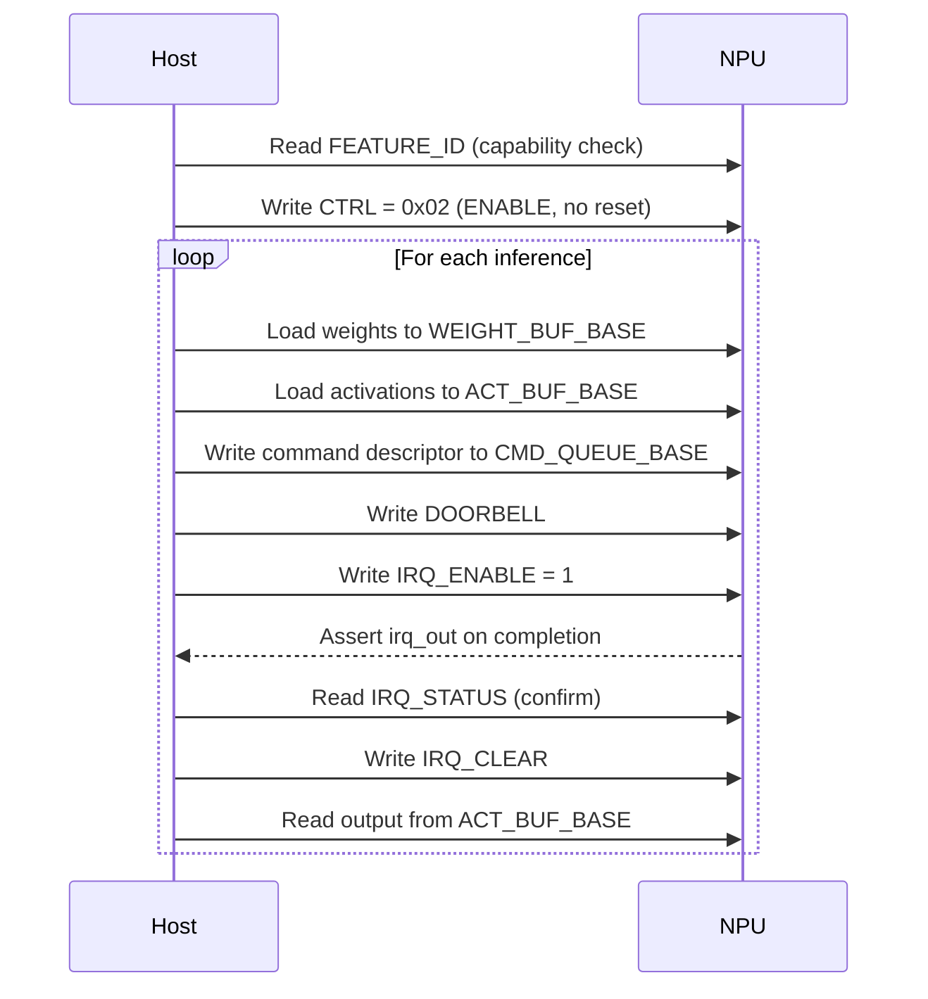

# Programming Model

This document describes how host software interacts with the NPU.

Sources of truth:
- Hardware: `include/pkg/npu_addrmap_pkg.sv`, `rtl/control/npu_reg_block.sv`, `rtl/core/npu_shell.sv`
- Runtime API: `sw/uapi/lgnpu_ioctl.h`, `sw/uapi/lgnpu_cmd.h`, `sw/uapi/lgnpu_tensor.h`
- Runtime implementation: `sw/runtime/`

---

## Interaction Overview

The NPU is a **host-programmed accelerator** with no local CPU or firmware.
All control is performed through MMIO registers.



---

## Step-by-Step

### 1. Initialisation

1. Read `FEATURE_ID` (`0x0018`) to verify hardware version and capabilities.
2. Write `CTRL` (`0x0000`) with `ENABLE = 1`, `SOFT_RESET = 0` -> value `0x02`.
3. Optionally enable interrupts: write `IRQ_ENABLE` (`0x0010`) = `1`.

### 2. Data Loading

Load tensor data through MMIO:

| Data | Target Window | Base Address |
|------|--------------|--------------|
| Weights | Weight buffer | `0x1_0000` |
| Input activations | Activation buffer | `0x2_0000` |

Each word written to the buffer window maps directly to SRAM. Addresses
within the window are byte-addressed, 32-bit aligned.

### 3. Command Submission

Write the 16-word command descriptor to `CMD_QUEUE_BASE` (`0x1000`). See
[command_format.md](../spec/command_format.md) for the field layout.

Then write any value to `DOORBELL` (`0x0008`) to trigger command fetch.

### 4. Completion

Two modes of completion notification:

| Mode | Mechanism |
|------|-----------|
| **Polling** | Read `STATUS` (`0x0004`) until `BUSY` = 0 and `IDLE` = 1 |
| **Interrupt** | Enable `IRQ_ENABLE[0]`; wait for `irq_out` assertion |

After interrupt fires, acknowledge by writing `IRQ_CLEAR` (`0x0014`).

### 5. Result Readback

Read the output activation tensor from the activation buffer window
(`0x2_0000`). The output is placed at the `act_out_addr` specified in the
command descriptor.

---

## Error Handling

v0.1 provides minimal error reporting. An error event (invalid opcode)
latches the IRQ pending flag the same way as command completion. Software
should check `STATUS` for unexpected states after an interrupt.

---

## Soft Reset

Writing `CTRL[0] = 1` asserts soft reset, which:

- Clears all command queue state
- Resets the backend FSM to IDLE
- Clears performance counters
- Clears pending interrupts

To release, write `CTRL = 0x02` (ENABLE only). Buffer SRAM contents are
**not** cleared by soft reset.

---

## Runtime API

The runtime library (`sw/runtime/`) provides a C API that wraps the
register-level interactions above. All public functions are declared in
headers under `sw/uapi/` and compiled into `liblgnpu_rt.a` / `.so`.

### Return Convention

Every API function that can fail returns `int`:

| Value | Meaning |
|-------|---------|
| `0` | Success |
| `-1` | Failure (invalid arguments) |

All pointer arguments are validated at the API boundary. Passing `NULL`
where a valid pointer is required returns `-1`. Internal static helpers
use compile-time `NO_NULL_ARGS` instead of runtime checks.

Performance counter readers (`npu_perf_read_*`) and `npu_irq_pending`
return their value directly (`uint32_t` / `int`); a `NULL` device
pointer returns `0`.

### Source Layout

| File | Purpose |
|------|---------|
| `sw/uapi/lgnpu_ioctl.h` | Device context, structs, MMIO/IRQ/DMA/perf API declarations |
| `sw/uapi/lgnpu_cmd.h` | Opcodes, parameter structs, command builder declarations |
| `sw/uapi/lgnpu_tensor.h` | Tensor descriptor, layout enums, validation/conversion API |
| `sw/uapi/lgnpu_regs.h` | Register offsets and bit masks (auto-generated) |
| `sw/runtime/liblgnpu.c` | Device lifecycle, status, IRQ, and perf counter implementations |
| `sw/runtime/submit.c` | Command submission and DMA transfer |
| `sw/runtime/command_builder.c` | Command descriptor packing for all six opcodes |
| `sw/runtime/tensor_desc.c` | Tensor validation and NCHW-to-NHWC conversion |
| `sw/runtime/mmio_helpers.h` | Static inline MMIO read/write wrappers |
| `sw/shared/annotations.h` | Cross-platform attribute macros |

### Device Lifecycle

```c
struct npu_device dev;

int rc = npu_open(&dev, mmio_base);    /* bind MMIO base pointer */
/* ... use device ... */
npu_close(&dev);                        /* clear base pointer */
```

| Function | Signature | Description |
|----------|-----------|-------------|
| `npu_open` | `int (struct npu_device*, volatile void*)` | Bind an MMIO base address to a device context. |
| `npu_close` | `int (struct npu_device*)` | Clear the device context. |

### Control

| Function | Signature | Description |
|----------|-----------|-------------|
| `npu_reset` | `int (struct npu_device*)` | Assert soft reset (`CTRL[0]`). |
| `npu_enable` | `int (struct npu_device*)` | Enable the NPU (`CTRL[1]`). |

### Status Queries

| Function | Signature | Description |
|----------|-----------|-------------|
| `npu_read_status` | `int (const struct npu_device*, struct npu_status*)` | Snapshot `STATUS` into `idle`, `busy`, `queue_full` fields. |
| `npu_read_info` | `int (const struct npu_device*, struct npu_device_info*)` | Decode `FEATURE_ID` into version, backend count, array size, dtype mask. |
| `npu_poll_idle` | `int (const struct npu_device*, uint32_t timeout_cycles)` | Spin until `IDLE && !BUSY` or timeout. Returns `-1` on timeout. |

### IRQ Management

| Function | Signature | Description |
|----------|-----------|-------------|
| `npu_irq_enable` | `int (struct npu_device*)` | Write `IRQ_ENABLE = 1`. |
| `npu_irq_disable` | `int (struct npu_device*)` | Write `IRQ_ENABLE = 0`. |
| `npu_irq_clear` | `int (struct npu_device*)` | Write `IRQ_CLEAR = 1`. |
| `npu_irq_pending` | `int (const struct npu_device*)` | Read `IRQ_STATUS[0]`. Returns `1` if pending, `0` otherwise. |

### Performance Counters

| Function | Signature | Description |
|----------|-----------|-------------|
| `npu_perf_read_cycles` | `uint32_t (const struct npu_device*)` | Read `PERF_CYCLES`. |
| `npu_perf_read_active` | `uint32_t (const struct npu_device*)` | Read `PERF_ACTIVE`. |
| `npu_perf_read_stall` | `uint32_t (const struct npu_device*)` | Read `PERF_STALL`. |

All three counters are cleared by soft reset.

### Command Submission

```c
struct npu_cmd_desc desc;
struct npu_conv_params p = { /* ... */ };

npu_cmd_build_conv(&desc, &p);    /* pack parameters into descriptor */
npu_submit(&dev, &desc);          /* write to queue + ring doorbell */
npu_poll_idle(&dev, 100000);      /* wait for completion */
```

| Function | Signature | Description |
|----------|-----------|-------------|
| `npu_submit` | `int (struct npu_device*, const struct npu_cmd_desc*)` | Write 16-word descriptor to `CMD_QUEUE_BASE` and ring `DOORBELL`. |
| `npu_cmd_build_conv` | `int (struct npu_cmd_desc*, const struct npu_conv_params*)` | Pack convolution parameters. |
| `npu_cmd_build_gemm` | `int (struct npu_cmd_desc*, const struct npu_gemm_params*)` | Pack GEMM parameters. |
| `npu_cmd_build_softmax` | `int (struct npu_cmd_desc*, const struct npu_softmax_params*)` | Pack softmax parameters. |
| `npu_cmd_build_vec` | `int (struct npu_cmd_desc*, const struct npu_vec_params*)` | Pack element-wise vector parameters. |
| `npu_cmd_build_lnorm` | `int (struct npu_cmd_desc*, const struct npu_lnorm_params*)` | Pack layer normalisation parameters. |
| `npu_cmd_build_pool` | `int (struct npu_cmd_desc*, const struct npu_pool_params*)` | Pack pooling parameters. |

Each builder zeroes the descriptor, sets the opcode, and packs fields
into the word positions defined in [command_format.md](../spec/command_format.md).

### DMA Transfers

```c
struct npu_dma_req req = {
    .ext_addr = host_phys_addr,
    .loc_addr = 0x0000,
    .len      = 4096,
    .dir      = LGNPU_DMA_TO_DEVICE,
};

npu_dma_start(&dev, &req);
npu_dma_poll(&dev, 100000);
```

| Function | Signature | Description |
|----------|-----------|-------------|
| `npu_dma_start` | `int (struct npu_device*, const struct npu_dma_req*)` | Program DMA registers and start transfer. |
| `npu_dma_poll` | `int (const struct npu_device*, uint32_t timeout_cycles)` | Spin until DMA idle or timeout. Returns `-1` on timeout. |

### Tensor Conversion

See [tensor_layouts.md](../spec/tensor_layouts.md) for the full layout
policy. The runtime validates and converts tensors before device submission:

```c
struct npu_tensor_desc td = {
    .base_addr = 0, .dim_n = 1, .dim_h = 4, .dim_w = 4,
    .dim_c = 3, .layout = LGNPU_LAYOUT_NCHW, .dtype = LGNPU_DTYPE_INT8,
};

enum npu_tensor_err err = npu_tensor_validate(&td);
err = npu_tensor_convert_to_nhwc(dst, src, &td, buf_size);
```

| Function | Returns | Description |
|----------|---------|-------------|
| `npu_tensor_validate` | `enum npu_tensor_err` | Check descriptor for null, zero dims, unsupported batch, unknown layout, overflow. |
| `npu_tensor_convert_to_nhwc` | `enum npu_tensor_err` | Convert from declared layout to NHWC. Identity copy when already NHWC. |

### Annotation Policy

Public API functions use the following attribute conventions (defined in
`sw/shared/annotations.h`):

| Rule | Rationale |
|------|-----------|
| `API_CALL` on every public function. | Marks the export boundary. |
| No `HOT_CALL` on API functions. | Hotness is at the caller's discretion. |
| No `NO_NULL_ARGS` on API functions. | All pointer arguments are checked at runtime instead. |
| `COLD_CALL` + `NO_INLINE` on lifecycle functions (`npu_open`, `npu_close`). | Called once; reduce icache pressure. |
| Annotations only in headers. | `.c` definitions carry no attribute macros. |
| Static-only helpers keep their own annotations. | Not part of the public API boundary. |