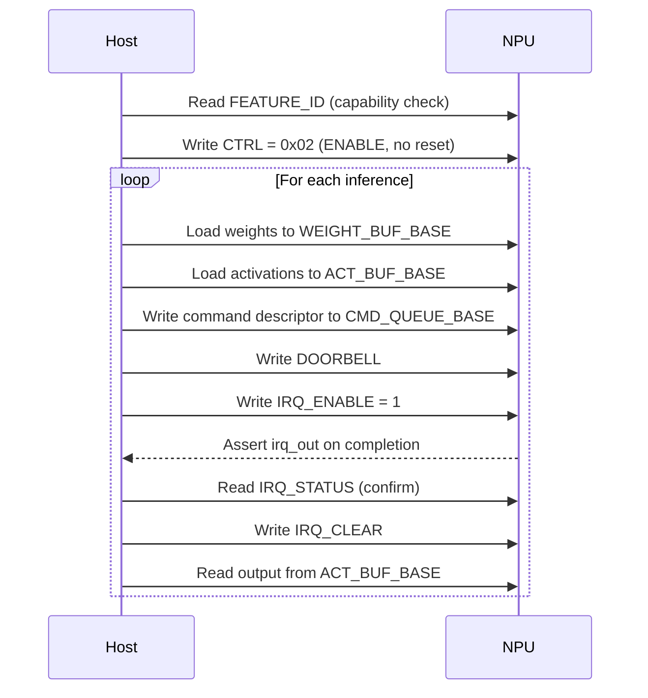

# Programming Model

This document describes how host software interacts with the NPU.

Sources of truth: `include/pkg/npu_addrmap_pkg.sv`, `rtl/control/npu_reg_block.sv`,
`rtl/core/npu_shell.sv`.

---

## Interaction Overview

The NPU is a **host-programmed accelerator** with no local CPU or firmware.
All control is performed through MMIO registers.

---

## Step-by-Step

### 1. Initialisation

1. Read `FEATURE_ID` (`0x0018`) to verify hardware version and capabilities.
2. Write `CTRL` (`0x0000`) with `ENABLE = 1`, `SOFT_RESET = 0` -> value `0x02`.
3. Optionally enable interrupts: write `IRQ_ENABLE` (`0x0010`) = `1`.

### 2. Data Loading

Load tensor data through MMIO:

| Data | Target Window | Base Address |
|------|--------------|--------------|
| Weights | Weight buffer | `0x1_0000` |
| Input activations | Activation buffer | `0x2_0000` |

Each word written to the buffer window maps directly to SRAM. Addresses
within the window are byte-addressed, 32-bit aligned.

### 3. Command Submission

Write the 16-word command descriptor to `CMD_QUEUE_BASE` (`0x1000`). See
[command_format.md](../spec/command_format.md) for the field layout.

Then write any value to `DOORBELL` (`0x0008`) to trigger command fetch.

### 4. Completion

Two modes of completion notification:

| Mode | Mechanism |
|------|-----------|
| **Polling** | Read `STATUS` (`0x0004`) until `BUSY` = 0 and `IDLE` = 1 |
| **Interrupt** | Enable `IRQ_ENABLE[0]`; wait for `irq_out` assertion |

After interrupt fires, acknowledge by writing `IRQ_CLEAR` (`0x0014`).

### 5. Result Readback

Read the output activation tensor from the activation buffer window
(`0x2_0000`). The output is placed at the `act_out_addr` specified in the
command descriptor.

---

## Error Handling

v0.1 provides minimal error reporting. An error event (invalid opcode)
latches the IRQ pending flag the same way as command completion. Software
should check `STATUS` for unexpected states after an interrupt.

---

## Soft Reset

Writing `CTRL[0] = 1` asserts soft reset, which:

- Clears all command queue state
- Resets the backend FSM to IDLE
- Clears performance counters
- Clears pending interrupts

To release, write `CTRL = 0x02` (ENABLE only). Buffer SRAM contents are
**not** cleared by soft reset.