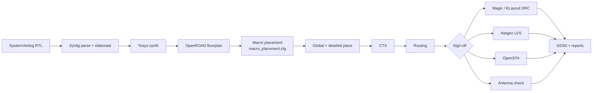

# Sky130 ASIC bring-up

This document walks through the OpenLane2 / sky130A flow used to take
`npu_shell` from RTL to GDSII. The flow targets the open-source PDK and
the public OpenRAM macros, so the entire pipeline runs without any
commercial tool licence.

## 1. Target summary

| Item                | Value                                                |
| ------------------- | ---------------------------------------------------- |
| Process             | SkyWater 130 nm, `sky130A` variant                   |
| Standard cell lib   | `sky130_fd_sc_hd`                                    |
| Top module          | `npu_shell`                                          |
| Clock               | 100 MHz (`CLOCK_PERIOD = 10.0` ns, single domain)    |
| Clock uncertainty   | 0.25 ns                                              |
| Die                 | 3200 um x 2400 um (absolute floorplan)               |
| Macros              | 14 SRAMs (2 weight + 4 act + 8 psum) tiled from one  |
|                     | 2 KB variant - see section 2                         |
| Stdcell count       | ~75 k (target; depends on synthesis)                 |
| Reset               | Async-asserted, sync-deasserted at the boundary      |
| Power pins          | `vccd1` / `vssd1` (guarded by `USE_POWER_PINS`)      |
| Flow                | OpenLane2 (>= 2.x)                                   |

## 2. SRAM macro inventory

Only the **2 KB 32x512 1RW+1R** variant ships pre-built in the public
OpenRAM macro repository (`https://github.com/efabless/sky130_sram_macros`),
so every on-chip buffer is **tiled** from that single macro. The wrappers
in `rtl/platform/mem_macro_*_wrap.sv` handle per-bank chip-select gating,
byte-lane packing for 8-bit logical interfaces, and the read-data mux
(`bank_sel_r` / `lane_r` latched one cycle alongside the access).

| Buffer               | Logical size | DEPTH x DATA_W | Banks | Banking decode                          |
| -------------------- | ------------ | -------------- | ----- | --------------------------------------- |
| Weight (`u_wt_buf`)  | 4 KB         | 4096 x 8       | 2     | `addr[10]` bank, `addr[1:0]` lane       |
| Activation (`u_act_buf`) | 8 KB     | 8192 x 8       | 4     | `addr[12:11]` bank, `addr[1:0]` lane    |
| Psum (`u_psum_buf`)  | 16 KB        | 4096 x 32      | 8     | `addr[11:9]` bank, port B tied off      |

All 14 instances are the same physical macro
(`sky130_sram_2kbyte_1rw1r_32x512_8`), footprint `683.1 x 416.54 um`.
They are placed in a 4-column x 4-row grid along the bottom of the die
(see `asic/openlane2/constraints/macro_placement.cfg`):

| Row | Macros                                       |
| --- | -------------------------------------------- |
| 0   | wt[0..1], act[0..1]                          |
| 1   | act[2..3], psum[0..1]                        |
| 2   | psum[2..5]                                   |
| 3   | psum[6..7]                                   |

The 8-bit buffers pack four byte lanes per 32-bit macro row and use
`wmask0` to gate the lane being written. The psum buffer uses the
upper address bits to select one of eight banks per access; only the
selected bank asserts `csb0=0`, the rest stay high.

## 3. Prerequisites

- Linux (or WSL2). The flow is exercised on Ubuntu 22.04 in this repo.
- Python >= 3.11, `pip`, `git`, `make`.
- Roughly 10 GB free disk space for the PDK + macro repos + run artefacts.

All other tooling (OpenLane2, Volare, the sky130 PDK, OpenRAM SRAM
macros) is installed by the bootstrap script described in the next section.

Version pins live in [`asic/scripts/versions.env`](../../asic/scripts/versions.env)
and the Python package set in [`asic/scripts/requirements.txt`](../../asic/scripts/requirements.txt).
CI sources both, so local and CI stay in lockstep.

## 4. Bootstrap the toolchain

One command brings up everything end to end:

```bash
make asic-sky130-bootstrap
```

It runs, in order:

| Step | Script                                | Outcome                                        |
| ---- | ------------------------------------- | ---------------------------------------------- |
| 1    | `pip install -r requirements.txt`     | OpenLane2 + Volare in the current venv         |
| 2    | `asic/scripts/install_pdk.sh`         | sky130A unpacked under `$HOME/.volare`         |
| 3    | `asic/scripts/stage_macros.sh`        | OpenRAM macros copied to `asic/openlane2/macros/` |
| 4    | `asic/scripts/setup_sky130_env.sh`    | Final env sanity check                         |

Every step is idempotent - rerunning skips work that is already done. The
individual steps are also wrapped as Makefile targets if you only need to
refresh one piece:

```bash
make asic-sky130-deps      # (1)  Python packages only
make asic-sky130-pdk       # (2)  PDK only
make asic-sky130-macros    # (3)  SRAM macros only
make asic-sky130-setup     # (4)  validate env
```

> The `volare enable --pdk sky130` invocation without arguments fails with
> "Could not determine open_pdks version". The wrapper here always passes
> the pinned commit from `versions.env`, sidestepping that lookup.

## 5. Source the environment

```bash
source asic/scripts/setup_sky130_env.sh
```

This exports `PDK_ROOT`, `PDK=sky130A`, `STD_CELL_LIBRARY=sky130_fd_sc_hd`,
and `SKY130A`. Required before invoking `make asic-sky130-flow` from a fresh
shell.

## 6. Run the flow

The Makefile drives the whole pipeline:

```bash
make asic-sky130-prep    # stage SV RTL -> asic/openlane2/src/rtl/*.sv
make asic-sky130-flow    # OpenLane2: Synlig synth -> P&R -> sign-off -> GDS
```

`asic-sky130-flow` invokes `asic/scripts/run_openlane.sh`, which in turn
calls `openlane` on `config.json` with the staged RTL.

The CI target `make asic-sky130-ci` skips the long sign-off stages
(LVS, antenna, DRC) and is used by the `asic-sky130` GitHub Actions
job to validate that the flow is wired correctly without burning the
full minutes budget on every push.

## 7. Sign-off gates

| Stage           | Tool          | Gate                                        |
| --------------- | ------------- | ------------------------------------------- |
| Synthesis       | Yosys         | Cell area report, no latch inferences       |
| STA (post-PnR)  | OpenSTA       | WNS >= 0 ns at TT/SS corners; hook script   |
|                 |               | in `asic/openlane2/scripts/sta_hook.tcl`    |
| DRC             | Magic + KLayout | Zero violations                            |
| LVS             | Netgen        | Zero mismatches (requires power pins, see   |
|                 |               | section 10)                                 |
| Antenna         | OpenROAD      | No remaining violators after diode insertion |

`config.json` pins these via `RUN_MAGIC_DRC`, `RUN_KLAYOUT_DRC`,
`RUN_LVS`, `RUN_ANTENNA_REPAIR`. `RUN_LINTER` is set to `false`
because the standalone `make lint` already covers Verilator lint and
the OpenLane step would re-blackbox the macro models redundantly.

## 8. Pipeline overview



## 9. Power pin propagation (TODO)

LVS sign-off requires `vccd1` / `vssd1` to be plumbed from the chip top
through every macro wrapper. The blackbox declarations in
`rtl/platform/sky130_sram_blackboxes.sv` already expose the pins under
`\`ifdef USE_POWER_PINS`, but the buffer wrappers and `npu_shell` do not
forward them yet. Until that refactor lands, run the flow with
`RUN_LVS = false` in `config.json` (or expect the LVS step to flag dangling pins).

The follow-up work is:

1. Add `\`ifdef USE_POWER_PINS inout vccd1, inout vssd1, \`endif` to
   `mem_macro_wrap`, `mem_macro_1rw1r_wrap`, `npu_local_mem_wrap`, the
   three buffer modules, `npu_buffer_router`, `npu_mem_top`, `npu_core`,
   and `npu_shell`.
2. Pass them through every instantiation.
3. Re-run `make lint` and `make sim-smoke`.

## 10. Troubleshooting

| Symptom                                              | Fix                                                                 |
| ---------------------------------------------------- | ------------------------------------------------------------------- |
| `openlane: command not found`                        | `make asic-sky130-deps` inside the active venv and reactivate it.   |
| `Failed to parse SystemVerilog during synthesis`     | Re-run `make asic-sky130-prep` and verify `tools/lint/rtl.f` lists all required sources/includes. |
| `Could not determine open_pdks version`              | `make asic-sky130-pdk` - the wrapper always passes the pinned commit. |
| `PDK_ROOT is empty`                                  | `source asic/scripts/setup_sky130_env.sh` or run `make asic-sky130-pdk`. |
| `Can't find LEF for sky130_sram_2kbyte_*`            | `make asic-sky130-macros`.                                           |
| `MODDUP` for `sky130_sram_2kbyte_*` in lint          | `prep_design.sh` already filters `sky130_sram_blackboxes.sv`; re-run `make asic-sky130-prep`. |
| `Option 'y' does not exist` from yosys               | OpenLane2 needs a yosys with `--enable-python`. Run with `--dockerized` (default in `run_openlane.sh`) or install OpenLane2 via nix. |
| Macro placement error citing a generate label        | Re-check `macro_placement.cfg`; per-bank paths look like `g_sky130.g_bank[i].u_sky130_sram`. |
| WNS < 0 at signoff                                   | Loosen `CLOCK_PERIOD`, tighten synthesis strategy, or pipeline      |
|                                                      | hot paths flagged in the STA hook report.                           |

## 11. Related documents

- `docs/arch/overview.md` - design-level architecture
- `docs/arch/memory_hierarchy.md` - buffer dataflow and macro mapping
- `docs/bringup/sim_bringup.md` - functional simulation flow
- `asic/openlane2/config.json` - flow knobs
