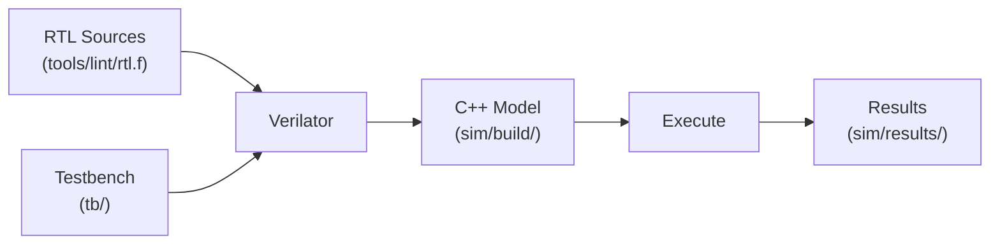

# Simulation Bringup

This document covers setting up and running RTL simulation for the lg-npu.

---

## Prerequisites

| Tool | Minimum Version | Purpose |
|------|----------------|---------|
| **Verilator** | 5.x | Lint, compile, simulation |
| **GNU Make** | 3.81+ | Build orchestration |
| **Python 3** | 3.8+ | Test vector generation, utilities |
| **GCC / Clang** | C++17 support | Verilator C++ model compilation |

---

## Quick Start

```bash
# 1. Lint check (no compilation)
make lint

# 2. Generate test vectors
make vectors

# 3. Run smoke regression (conv + control + perf)
make sim-smoke

# 4. Run full regression (all 196 tests)
make sim-full
```

---

## Make Targets

| Target | Description |
|--------|-------------|
| `make lint` | Verilator lint (`-Wall`) on all RTL via `tools/lint/rtl.f` |
| `make compile` | Verilate + build C++ model into `sim/build/` |
| `make sim-e2e` | Compile and run the original E2E convolution test |
| `make sim-conv-tests` | Run deterministic conv test suite (10 cases) |
| `make sim-control-tests` | Run control/sequencing test suite (8 cases) |
| `make sim-perf-tests` | Run performance counter test suite (3 cases) |
| `make sim-full-tests` | Run full regression suite (175 cases) |
| `make sim-smoke` | Run conv + control + perf suites (21 tests) |
| `make sim-full` | Run smoke + full regression (196 tests) |
| `make vectors` | Generate test vectors from Python reference models |
| `make waves` | Open the latest VCD waveform in Surfer viewer |
| `make viz` | Generate architecture diagrams into `docs/diagrams/` |

---

## Simulation Flow



Each Makefile test target performs these steps:

1. Verilate the RTL + C++ test harness into a build directory.
2. Build and run the C++ executable.
3. Report PASS / FAIL based on the exit code.

---

## File List

The RTL compilation order is defined in [tools/lint/rtl.f](../../tools/lint/rtl.f).
This file lists all packages, common modules, and design hierarchy in
dependency order. Both lint and simulation share the same file list.

---

## Test Vectors

Reference vectors are generated from Python models:

```bash
make vectors
```

This runs `model/vectors/gen_conv_vectors.py` and
`model/vectors/gen_quant_vectors.py`, placing output files in `tb/vectors/`.
Testbenches load these vectors to compare RTL output against the golden
reference.

---

## Waveform Viewing

When `--trace` is enabled (default in `make compile`), VCD waveform files
are written to `sim/waves/`. The end-to-end test produces `sim/waves/e2e.vcd`.

### Quick open

```bash
make waves          # launches Surfer (via tools/visualize/open_surfer.sh)
```

Alternatively, open manually with GTKWave or any VCD-compatible viewer:

```bash
gtkwave sim/waves/e2e.vcd
```

### Key signals to inspect

| Signal | Location | Purpose |
|--------|----------|---------|
| `mmio_addr`, `mmio_wdata`, `mmio_ready` | `TOP.npu_shell` | Host MMIO traffic |
| `state` | `conv_ctrl` | Backend FSM state |
| `pair_valid`, `act_out`, `wt_out` | `conv_loader` | Data feeding the PE |
| `acc_out` | `conv_pe` | Accumulator output |
| `idle`, `busy` | `npu_status` | Completion status |

---

## Regression Lists

| File | Contents |
|------|----------|
| `sim/regressions/smoke.list` | Unit + block tests (fast sanity) |
| `sim/regressions/full.list` | Unit + block + integration (complete) |

Custom regression lists can be run with:

```bash
bash sim/scripts/run_all.sh path/to/custom.list
```