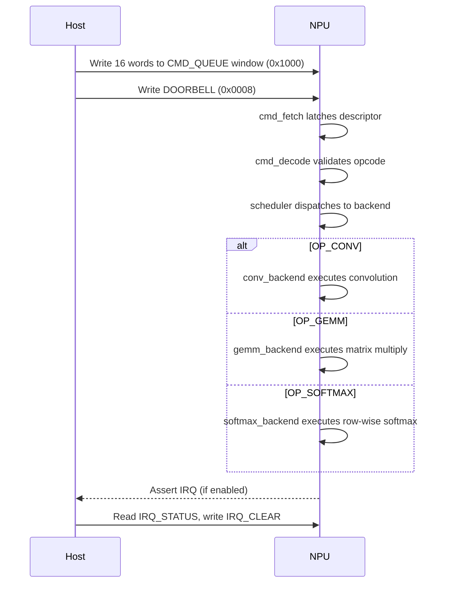

# Command Descriptor Format

A command descriptor is a 16-word (64-byte) structure written by the host
into the command queue window. After writing the descriptor, the host writes
to the `DOORBELL` register to trigger command fetch.

Source of truth: `include/pkg/npu_cmd_pkg.sv`.

---

## Opcodes

| Opcode | Value | Description |
|--------|-------|-------------|
| `OP_CONV` | `4'h1` | 2-D convolution (INT8 -> INT32 accumulate -> INT8 output) |
| `OP_GEMM` | `4'h2` | General matrix multiply (INT8 -> INT32 accumulate -> INT8 output) |
| `OP_SOFTMAX` | `4'h3` | Row-wise softmax (INT8 -> INT8 output in [0, 127]) |

All other opcode values are reserved. The hardware rejects reserved opcodes
by raising the error event (`decode_err`) which sets `IRQ_STATUS.PENDING`,
discards the command, and returns to idle. See [interrupts.md](interrupts.md).

Dispatch priority: GEMM > Softmax > Convolution.

---

## Descriptor Layout

All opcodes share the same 16-word descriptor structure.
Fields that are unused by a given opcode should be written as zero.

### Convolution (`OP_CONV`)

| Word | Field | Width | Description |
|------|-------|-------|-------------|
| 0 | `opcode` | 4 bits (LSBs) | `4'h1` |
| 1 | `act_in_addr` | 16 bits | Input activation base address (local SRAM) |
| 2 | `act_out_addr` | 16 bits | Output activation base address |
| 3 | `weight_addr` | 16 bits | Weight base address |
| 4 | `bias_addr` | 16 bits | Bias base address |
| 5 | `in_h` | 16 bits | Input height |
| 6 | `in_w` | 16 bits | Input width |
| 7 | `in_c` | 16 bits | Input channels |
| 8 | `out_k` | 16 bits | Output channels (number of filters) |
| 9 | `filt_r` | 16 bits | Filter height |
| 10 | `filt_s` | 16 bits | Filter width |
| 11 | `stride_h` | 16 bits | Vertical stride |
| 12 | `stride_w` | 16 bits | Horizontal stride |
| 13 | `pad_h` | 16 bits | Vertical zero-padding (each side) |
| 14 | `pad_w` | 16 bits | Horizontal zero-padding (each side) |
| 15 | `quant_shift` | 5 bits (bits [4:0]) | Right-shift for INT32->INT8 quantisation |
| 15 | `act_mode` | 2 bits (bits [6:5]) | Activation function: 0 = None, 1 = ReLU, 2 = Leaky ReLU |

### GEMM (`OP_GEMM`)

GEMM reuses the same word positions as convolution. Unused convolution fields
(words 8-14) must be zero.

| Word | Field (GEMM alias) | Width | Description |
|------|-------------------|-------|-------------|
| 0 | `opcode` | 4 bits (LSBs) | `4'h2` |
| 1 | `a_addr` | 16 bits | Matrix A base address (activation buffer, row-major M x K) |
| 2 | `c_addr` | 16 bits | Output matrix C base address (activation buffer, row-major M x N) |
| 3 | `b_addr` | 16 bits | Matrix B base address (weight buffer, row-major K x N) |
| 4 | `bias_addr` | 16 bits | Bias vector base address (weight buffer, length N) |
| 5 | `M` | 16 bits | Number of rows in A / rows in C |
| 6 | `N` | 16 bits | Number of columns in B / columns in C |
| 7 | `K` | 16 bits | Number of columns in A / rows in B (reduction dimension) |
| 8-14 | reserved | - | Must be zero |
| 15 | `quant_shift` | 5 bits (bits [4:0]) | Right-shift for INT32->INT8 quantisation |
| 15 | `act_mode` | 2 bits (bits [6:5]) | Activation function: 0 = None, 1 = ReLU, 2 = Leaky ReLU |

Unused upper bits within each 32-bit word are reserved and should be written
as zero.

### Softmax (`OP_SOFTMAX`)

Softmax applies the softmax function independently to each row of an M x N
matrix. Unused convolution fields (words 3-4, 7-15) must be zero.

| Word | Field (Softmax alias) | Width | Description |
|------|----------------------|-------|-------------|
| 0 | `opcode` | 4 bits (LSBs) | `4'h3` |
| 1 | `in_addr` | 16 bits | Input base address (activation buffer, row-major M x N) |
| 2 | `out_addr` | 16 bits | Output base address (activation buffer, row-major M x N) |
| 3-4 | reserved | - | Must be zero |
| 5 | `num_rows` (M) | 16 bits | Number of independent softmax rows |
| 6 | `row_len` (N) | 16 bits | Elements per row (softmax dimension) |
| 7-15 | reserved | - | Must be zero |

The output for each element is `floor(exp_approx(x_i) * 127 / sum)` where
`exp_approx` uses a two-table LUT decomposition and `sum` is the sum of all
approximated exponentials in the row. Output values are INT8 in [0, 127].

The weight buffer and bias port are not used by softmax.

---

## Processing Flow



---

## Convolution Output Dimensions

The output spatial dimensions are computed as:

```math
\text{out\_h} = \frac{\text{in\_h} + 2 \cdot \text{pad\_h} - \text{filt\_r}}{\text{stride\_h}} + 1
```

```math
\text{out\_w} = \frac{\text{in\_w} + 2 \cdot \text{pad\_w} - \text{filt\_s}}{\text{stride\_w}} + 1
```

The output channel count equals `out_k`.

---

## GEMM Addressing

Matrices are stored in row-major order in local SRAM:

- **A** (M x K) in the activation buffer: element A\[m, k\] at byte offset `a_addr + m * K + k`.
- **B** (K x N) in the weight buffer: element B\[k, n\] at byte offset `b_addr + k * N + n`.
- **C** (M x N) in the activation buffer: element C\[m, n\] at byte offset `c_addr + m * N + n`.
- **Bias** (length N) in the weight buffer: element bias\[n\] at byte offset `bias_addr + n`.

The output element count equals `M * N`.