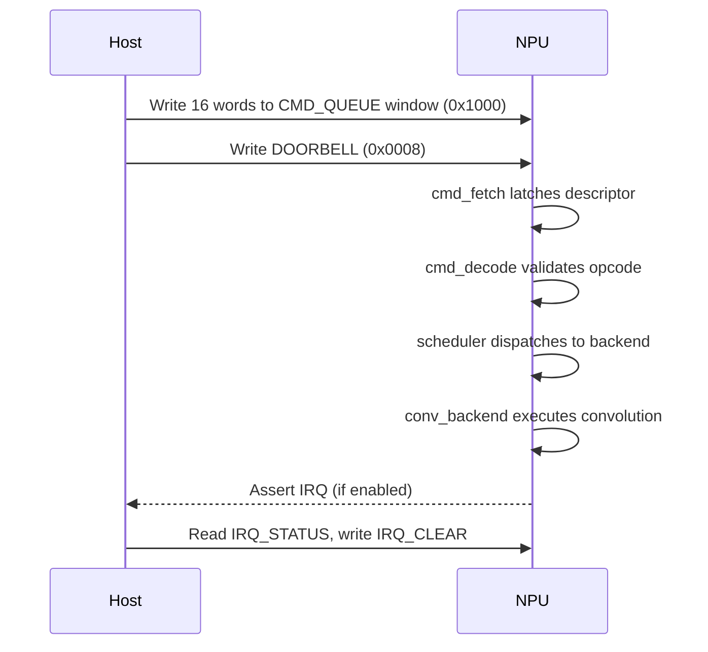

# Command Descriptor Format

A command descriptor is a 16-word (64-byte) structure written by the host
into the command queue window. After writing the descriptor, the host writes
to the `DOORBELL` register to trigger command fetch.

Source of truth: `include/pkg/npu_cmd_pkg.sv`.

---

## Opcodes

| Opcode | Value | Description |
|--------|-------|-------------|
| `OP_CONV` | `4'h1` | 2-D convolution (INT8 -> INT32 accumulate -> INT8 output) |

All other opcode values are reserved. The hardware rejects reserved opcodes
by raising the error event (`decode_err`) which sets `IRQ_STATUS.PENDING`,
discards the command, and returns to idle. See [interrupts.md](interrupts.md).

---

## Descriptor Layout

| Word | Field | Width | Description |
|------|-------|-------|-------------|
| 0 | `opcode` | 4 bits (LSBs) | Operation selector |
| 1 | `act_in_addr` | 16 bits | Input activation base address (local SRAM) |
| 2 | `act_out_addr` | 16 bits | Output activation base address |
| 3 | `weight_addr` | 16 bits | Weight base address |
| 4 | `bias_addr` | 16 bits | Bias base address |
| 5 | `in_h` | 16 bits | Input height |
| 6 | `in_w` | 16 bits | Input width |
| 7 | `in_c` | 16 bits | Input channels |
| 8 | `out_k` | 16 bits | Output channels (number of filters) |
| 9 | `filt_r` | 16 bits | Filter height |
| 10 | `filt_s` | 16 bits | Filter width |
| 11 | `stride_h` | 16 bits | Vertical stride |
| 12 | `stride_w` | 16 bits | Horizontal stride |
| 13 | `pad_h` | 16 bits | Vertical zero-padding (each side) |
| 14 | `pad_w` | 16 bits | Horizontal zero-padding (each side) |
| 15 | `quant_shift` | 5 bits (bits [4:0]) | Right-shift for INT32->INT8 quantisation |
| 15 | `act_mode` | 2 bits (bits [6:5]) | Activation function: 0 = None, 1 = ReLU, 2 = Leaky ReLU |

Unused upper bits within each 32-bit word are reserved and should be written
as zero.

---

## Processing Flow



---

## Output Dimensions

The output spatial dimensions are computed as:

```math
\text{out\_h} = \frac{\text{in\_h} + 2 \cdot \text{pad\_h} - \text{filt\_r}}{\text{stride\_h}} + 1
```

```math
\text{out\_w} = \frac{\text{in\_w} + 2 \cdot \text{pad\_w} - \text{filt\_s}}{\text{stride\_w}} + 1
```

The output channel count equals `out_k`.