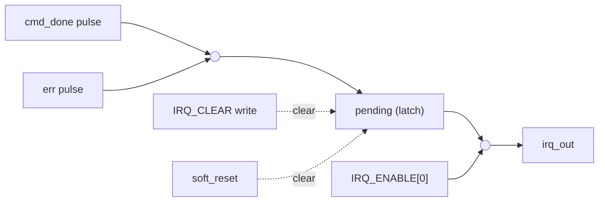

# Interrupts

The NPU exposes a single level-sensitive interrupt line (`irq_out`) to the
host.

Source of truth: `rtl/control/npu_irq_ctrl.sv`.

---

## Architecture

---

## Registers

| Register | Offset | Behaviour |
|----------|--------|-----------|
| `IRQ_STATUS` | `0x000C` | Read returns `{31'b0, pending}`. |
| `IRQ_ENABLE` | `0x0010` | Bit 0 enables the interrupt output. |
| `IRQ_CLEAR` | `0x0014` | Any write clears `pending`. |

---

## Interrupt Lifecycle

1. Backend completes a command -> `cmd_done` pulses high for one cycle.
2. `pending` latch is set (stays high until cleared).
3. If `IRQ_ENABLE[0]` is set, `irq_out` is asserted.
4. Host observes interrupt, reads `IRQ_STATUS` to confirm.
5. Host writes `IRQ_CLEAR` -> `pending` falls, `irq_out` deasserts.

An error event follows the same path (OR'd with `cmd_done`).

---

## Reset Behaviour

Both hard reset and soft reset (`CTRL[0]`) clear the `pending` latch and
deassert `irq_out`. The `IRQ_ENABLE` register is cleared to 0 on reset
(interrupts disabled by default).