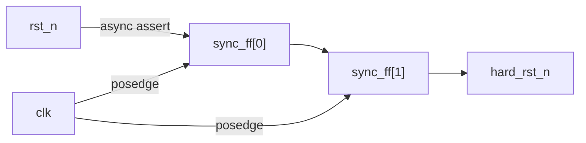

# Reset & Boot Flow

Source of truth: `rtl/control/npu_reset_ctrl.sv`.

---

## Reset Sources

The NPU has two reset sources, combined with a logical OR:

| Source | Trigger | Duration |
|--------|---------|----------|
| Hard reset | External `rst_n` pin de-asserted low | Until `rst_n` goes high |
| Soft reset | Host writes `CTRL[0] = 1` | While `CTRL[0]` is held high |

---

## Synchroniser

The external asynchronous `rst_n` passes through a 2-stage
async-assert / sync-deassert synchroniser to prevent metastability:



- **Assert**: When `rst_n` falls, both flip-flops are immediately forced
  low (asynchronous reset on the flops).
- **Deassert**: When `rst_n` rises, the `1` propagates through the two
  stages on successive clock edges, ensuring a glitch-free release aligned
  to `clk`.

---

## Combined Reset

```
rst_out_n = hard_rst_n & ~soft_reset
```

`rst_out_n` drives all other modules. It is low (active) whenever either
reset source is active.

---

## Boot Sequence

After power-on or hard reset release:

1. `rst_out_n` deasserts on the second `clk` edge after `rst_n` rises.
2. All registers initialise to their reset values:
   - `CTRL` = `0` (ENABLE off, SOFT_RESET off)
   - `STATUS.IDLE` = `1`
   - `IRQ_ENABLE` = `0` (interrupts masked)
   - `IRQ pending` = `0`
   - Performance counters = `0`
3. Command queue is empty; `QUEUE_FULL` = `0`.
4. NPU is ready to accept commands.

No firmware load or boot ROM is required in v0.1 — the NPU is a
host-programmed accelerator with no local CPU.