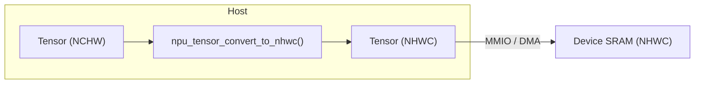

# Tensor Layouts

This document describes the tensor layout policy for the NPU: which
layouts exist, which one the hardware uses, and how the runtime converts
between them.

Sources of truth:
- Hardware: `include/pkg/npu_tensor_pkg.sv`
- Runtime API: `sw/uapi/npu_tensor.h`
- Runtime implementation: `sw/runtime/tensor_desc.c`

---

## Canonical Internal Layout

The NPU hardware operates exclusively in **NHWC** (channel-last).
Every byte stored in device SRAM follows NHWC ordering.  No layout
field is carried in the hardware command descriptor; the backends
always interpret addresses as NHWC.

```math
\text{addr}(n, h, w, c) = \text{base} + \bigl((n \cdot H + h) \cdot W + w\bigr) \cdot C + c
```

This decision is fixed: all address generators, PE arrays, and buffer
routers assume NHWC.

---

## Supported External Layouts

The runtime API (`sw/uapi/npu_tensor.h`) accepts the following layouts
and converts them to NHWC before loading data into device SRAM.

| Enum | Value | Memory order | Stride (innermost to outermost) |
|------|-------|--------------|---------------------------------|
| `LGNPU_LAYOUT_NHWC` | 0 | N, H, W, **C** | 1, W\*C, C, H\*W\*C |
| `LGNPU_LAYOUT_NCHW` | 1 | N, **C**, H, W | 1, W, H\*W, C\*H\*W |

When `layout == LGNPU_LAYOUT_NHWC` the data is already in canonical form
and is copied unchanged.

---

## Conversion Rules

The runtime normalizes external layouts to NHWC on the host before any
DMA or MMIO transfer to the device.

### NCHW to NHWC

```math
\text{src}_{idx} = \bigl((n \cdot C + c) \cdot H + h\bigr) \cdot W + w
```

```math
\text{dst}_{idx} = \bigl((n \cdot H + h) \cdot W + w\bigr) \cdot C + c
```



This is a pure element permutation with no arithmetic (values are not
modified, only reordered).  For INT8 tensors the cost is one byte copy
per element.

### NHWC to NHWC

Identity (`memcpy`).

---

## Validation Rules

`npu_tensor_validate()` enforces the following constraints on every
tensor descriptor before conversion or submission:

| Check | Error code | Description |
|-------|-----------|-------------|
| Non-null pointer | `LGNPU_TENSOR_ERR_NULL_PTR` | Descriptor pointer must not be NULL. |
| Positive dimensions | `LGNPU_TENSOR_ERR_ZERO_DIM` | N, H, W, C must all be > 0. |
| Batch == 1 | `LGNPU_TENSOR_ERR_BATCH_UNSUP` | v0.1 only supports batch size 1. |
| Known layout | `LGNPU_TENSOR_ERR_LAYOUT_UNKNOWN` | Layout must be < `LGNPU_LAYOUT_COUNT`. |
| No overflow | `LGNPU_TENSOR_ERR_OVERFLOW` | H\*W\*C must fit in uint32\_t. |

`npu_tensor_convert_to_nhwc()` additionally checks `dst` and `src`
for NULL (returning `LGNPU_TENSOR_ERR_NULL_PTR`) and verifies
`buf_bytes >= byte_size` (returning `LGNPU_TENSOR_ERR_BUF_TOO_SMALL`)
before performing the conversion.

---

## Tensor Descriptor

The `npu_tensor_desc` struct carries metadata for one tensor.
Dimensions always use the NHWC naming convention irrespective of the
declared layout.

| C field | SV field | Width | Description |
|---------|----------|-------|-------------|
| `base_addr` | `base_addr` | 16 bits | SRAM byte address of element \[0\]\[0\]\[0\]\[0\] |
| `dim_n` | `dim_n` | 16 bits | Batch (must be 1) |
| `dim_h` | `dim_h` | 16 bits | Height (or rows) |
| `dim_w` | `dim_w` | 16 bits | Width (or columns) |
| `dim_c` | `dim_c` | 16 bits | Channels |
| `layout` | `layout` | 2 bits | `tensor_layout_e` / `enum npu_tensor_layout` |
| `dtype` | - | 3 bits | `enum npu_dtype` (C only; SV uses `dtype_e` from `npu_types_pkg`) |

The SV-side `tensor_desc_t` is defined in `npu_tensor_pkg.sv`.
The C-side `struct npu_tensor_desc` is defined in `sw/uapi/npu_tensor.h`.

---

## Data Types

| Tensor | Element type | Width |
|--------|-------------|-------|
| Input activations | INT8 | 8 bits |
| Weights | INT8 | 8 bits |
| Biases | INT8 | 8 bits |
| Partial sums | INT32 | 32 bits |
| Output activations | INT8 | 8 bits (after quantisation) |

All INT8 values are **signed** two's-complement.

---

## Weight Tensors

Convolution weight tensors have four dimensions: K (output channels),
R (filter height), S (filter width), C (input channels).  The same
layout policy applies:

| Software layout | NHWC mapping | Memory order |
|-----------------|-------------|--------------|
| KRSC (NHWC-style) | N=K, H=R, W=S, C=C | `((k*R + r)*S + s)*C + c` |
| KCRS (NCHW-style) | N=K, H=R, W=S, C=C | `((k*C + c)*R + r)*S + s` |

The caller maps weight dimensions onto the N/H/W/C descriptor fields
and sets the layout accordingly.  The runtime conversion is the same
NCHW-to-NHWC permutation.